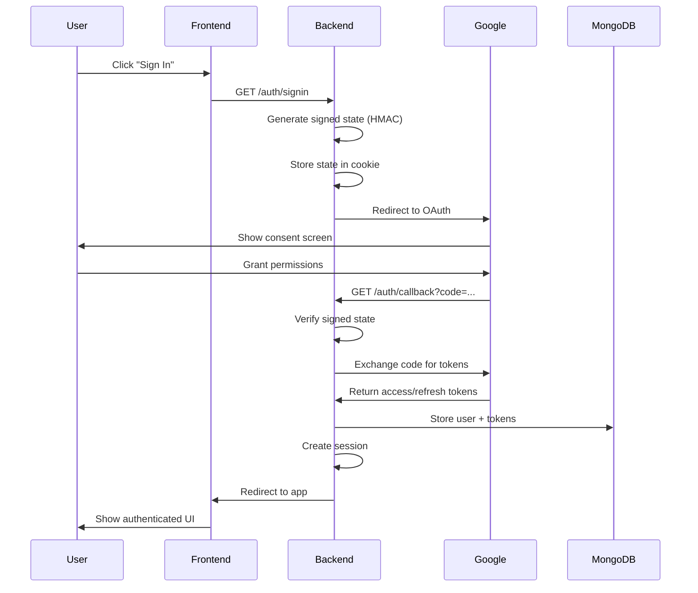
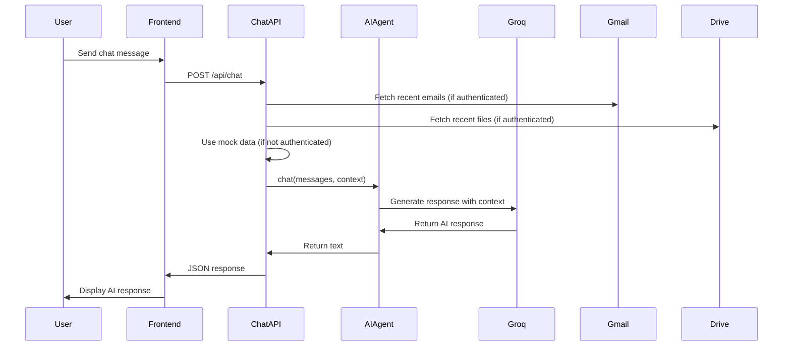
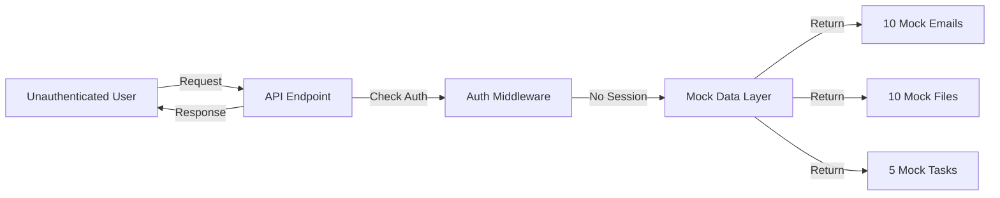
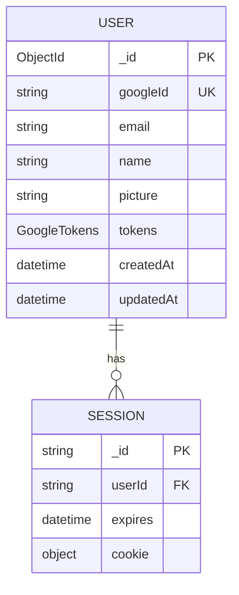
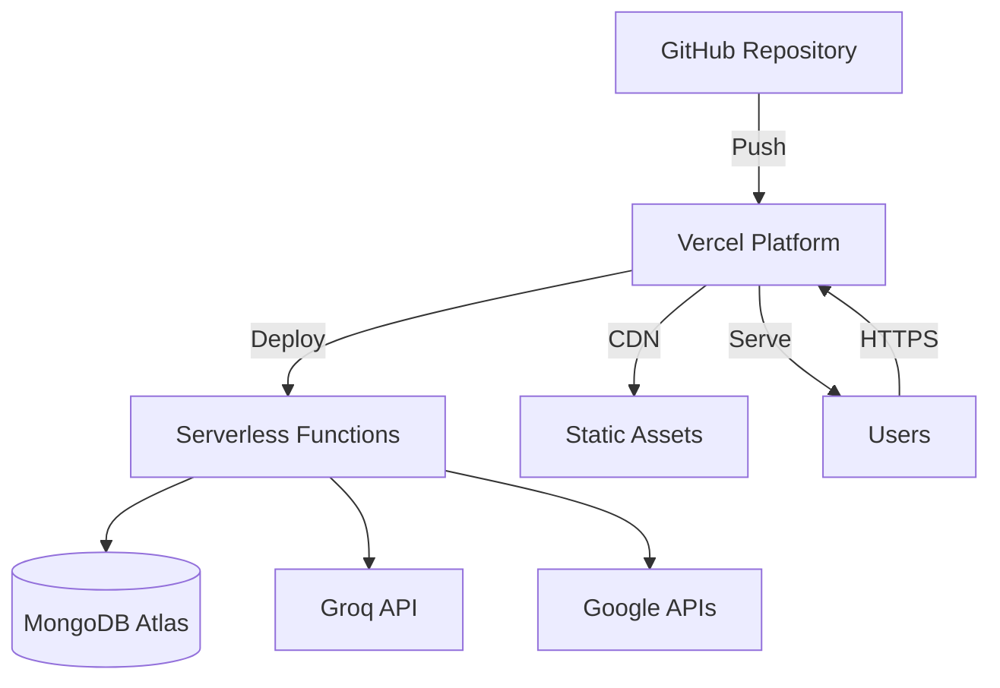

# AI Agent Architecture Diagram

## System Overview

This document provides a comprehensive architecture diagram of the AI Agent application.

## Architecture Diagram

```mermaid
graph TB
    subgraph "Client Layer"
        UI[Frontend UI<br/>tabs/personal/<br/>HTML/CSS/JS]
        UI -->|HTTP/HTTPS| API
        UI -->|OAuth Redirect| GoogleAuth
    end

    subgraph "Vercel/Serverless"
        API[Express Server<br/>src/server.ts]
        
        subgraph "API Routes"
            AuthAPI[/auth/*<br/>OAuth Flow]
            ChatAPI[/api/chat<br/>AI Interactions]
            FilesAPI[/api/files<br/>Drive Data]
            MessagesAPI[/api/messages<br/>Gmail Data]
            TasksAPI[/api/tasks<br/>Task Management]
            HealthAPI[/api/health<br/>Status Checks]
        end
        
        API --> AuthAPI
        API --> ChatAPI
        API --> FilesAPI
        API --> MessagesAPI
        API --> TasksAPI
        API --> HealthAPI
    end

    subgraph "Authentication Layer"
        AuthMW[Auth Middleware<br/>optionalAuth/requireAuth]
        Session[Express Session<br/>MongoDB Store]
        AuthAPI --> AuthMW
        AuthMW --> Session
    end

    subgraph "Google Services"
        GoogleAuth[Google OAuth 2.0<br/>accounts.google.com]
        GmailAPI[Gmail API<br/>gmail.googleapis.com]
        DriveAPI[Drive API<br/>drive.googleapis.com]
        CalendarAPI[Calendar API<br/>calendar.googleapis.com]
        
        AuthAPI -->|OAuth Flow| GoogleAuth
        MessagesAPI -->|API Calls| GmailAPI
        FilesAPI -->|API Calls| DriveAPI
        TasksAPI -->|API Calls| GmailAPI
    end

    subgraph "AI Service Layer"
        AIAgent[AI Agent<br/>src/ai/agent.ts]
        GroqAPI[Groq API<br/>api.groq.com<br/>Llama 3.3 70B]
        
        ChatAPI --> AIAgent
        TasksAPI --> AIAgent
        AIAgent -->|LLM Requests| GroqAPI
    end

    subgraph "Data Layer"
        MongoDB[(MongoDB Atlas<br/>User Data<br/>OAuth Tokens<br/>Sessions)]
        MockData[Mock Data<br/>mockEmails.ts<br/>mockFiles.ts]
        
        Session --> MongoDB
        AuthAPI --> MongoDB
        MessagesAPI -.->|Fallback| MockData
        FilesAPI -.->|Fallback| MockData
        ChatAPI -.->|Demo Mode| MockData
    end

    subgraph "Repository Pattern"
        UserRepo[UserRepository<br/>CRUD Operations]
        BaseRepo[BaseRepository<br/>Generic DB Access]
        
        AuthAPI --> UserRepo
        UserRepo --> BaseRepo
        BaseRepo --> MongoDB
    end

    style UI fill:#6366f1,stroke:#4f46e5,color:#fff
    style API fill:#8b5cf6,stroke:#7c3aed,color:#fff
    style GroqAPI fill:#10b981,stroke:#059669,color:#fff
    style MongoDB fill:#3b82f6,stroke:#2563eb,color:#fff
    style GoogleAuth fill:#ea4335,stroke:#c5221f,color:#fff
    style MockData fill:#f59e0b,stroke:#d97706,color:#fff
```

## Component Details

### 1. Client Layer (Frontend)
- **Location**: `tabs/personal/`
- **Technologies**: HTML5, CSS3, JavaScript (ES6+)
- **Features**:
  - Gmail-like email interface
  - AI chat interface
  - File browser
  - Task management UI
  - Profile dropdown with auth controls

### 2. Express Server
- **Entry Point**: `src/server.ts`
- **Middleware Stack**:
  1. Cookie Parser
  2. Express Session (MongoDB-backed)
  3. CORS
  4. JSON Parser
  5. Request Logging
  6. Static File Serving
  7. API Routes
  8. Error Handling

### 3. API Routes

#### `/auth/*` - Authentication
- `GET /auth/signin` - Initiate OAuth flow
- `GET /auth/callback` - Handle OAuth callback
- `GET /auth/signout` - Destroy session
- `GET /api/auth/status` - Check auth status

#### `/api/chat/*` - AI Interactions
- `POST /api/chat` - Chat with AI agent
- `POST /api/chat/stream` - Stream chat responses
- `GET /api/chat/tasks` - Extract tasks from emails
- `GET /api/chat/summary` - Daily briefing
- `POST /api/chat/summarize-email` - Summarize specific email

#### `/api/files` - Google Drive
- `GET /api/files` - List recent files
- Returns mock data when unauthenticated

#### `/api/messages` - Gmail
- `GET /api/messages` - List recent emails
- Returns mock data when unauthenticated

#### `/api/tasks` - Task Management
- `GET /api/tasks` - List tasks
- `POST /api/tasks` - Create task

#### `/api/health` - Health Checks
- `GET /api/health` - Server status
- `GET /api/health/db` - Database status

### 4. Authentication Flow



### 5. AI Agent Flow



### 6. Data Flow - Demo Mode



### 7. Database Schema



### 8. Technology Stack

#### Frontend
- **HTML5** - Structure
- **CSS3** - Styling (Glassmorphism design)
- **JavaScript (ES6+)** - Interactivity
- **Lucide Icons** - Icon library

#### Backend
- **Node.js** - Runtime
- **Express.js** - Web framework
- **TypeScript** - Type safety
- **tsx** - TypeScript execution

#### Authentication
- **Google OAuth 2.0** - Authentication
- **express-session** - Session management
- **connect-mongo** - MongoDB session store
- **HMAC** - State verification (Vercel-compatible)

#### Database
- **MongoDB Atlas** - Cloud database
- **MongoDB Driver** - Database client
- **Repository Pattern** - Data access layer

#### AI/ML
- **Groq API** - LLM provider
- **Llama 3.3 70B** - Language model
- **Vercel AI SDK** - AI integration
- **Zod** - Schema validation

#### Google APIs
- **googleapis** - Google API client
- **google-auth-library** - OAuth client
- **Gmail API** - Email access
- **Drive API** - File access
- **Calendar API** - Event access (future)

#### Deployment
- **Vercel** - Serverless hosting
- **GitHub Actions** - CI/CD
- **Environment Variables** - Configuration

### 9. Security Features

1. **OAuth State Verification**
   - HMAC-signed state parameter
   - Prevents CSRF attacks
   - Works in serverless environments

2. **Session Security**
   - HttpOnly cookies
   - Secure cookies in production
   - SameSite protection
   - MongoDB-backed sessions

3. **CORS Protection**
   - Whitelist-based origin checking
   - Credentials support
   - Preflight handling

4. **Error Handling**
   - Centralized error middleware
   - No stack traces in production
   - Structured error responses

### 10. Demo Mode Architecture

The application supports a **demo mode** that works without authentication:

- **Mock Data Sources**:
  - `src/google/mockEmails.ts` - 10 realistic emails
  - `src/google/mockFiles.ts` - 10 realistic files
  - `src/api/chat.ts` - Mock tasks and summaries

- **Fallback Strategy**:
  1. Try to fetch real data (if authenticated)
  2. Fall back to mock data on error
  3. Always return data (never show errors to user)

- **Benefits**:
  - Demo works immediately
  - No Google account required
  - Showcases all features
  - Professional presentation

## Deployment Architecture



## Environment Variables

```bash
# Google OAuth
GOOGLE_CLIENT_ID=
GOOGLE_CLIENT_SECRET=
GOOGLE_REDIRECT_URI=

# Database
MONGODB_URI=

# AI
GROQ_API_KEY=

# Session
SESSION_SECRET=

# Server
PORT=3978
NODE_ENV=production
```

## Key Design Decisions

1. **HMAC-based OAuth State**: Solves Vercel serverless cookie persistence issues
2. **Optional Auth Middleware**: Enables demo mode without breaking real auth
3. **Repository Pattern**: Clean separation of data access logic
4. **Mock Data Fallback**: Ensures demo always works
5. **TypeScript**: Type safety across the entire codebase
6. **Serverless-First**: Designed for Vercel's serverless architecture

## Future Enhancements

- [ ] Calendar integration
- [ ] Real-time updates (WebSockets)
- [ ] File uploads
- [ ] Email composition
- [ ] Task synchronization
- [ ] Multi-user support
- [ ] Advanced AI features (RAG, embeddings)

