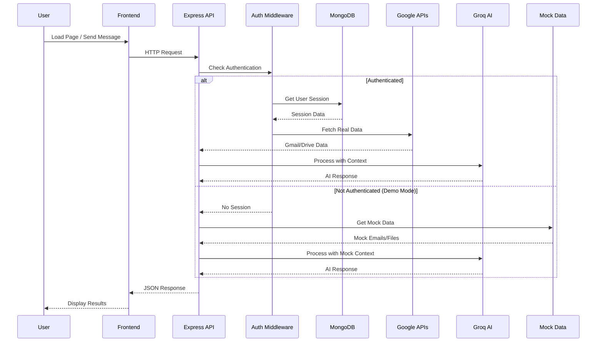
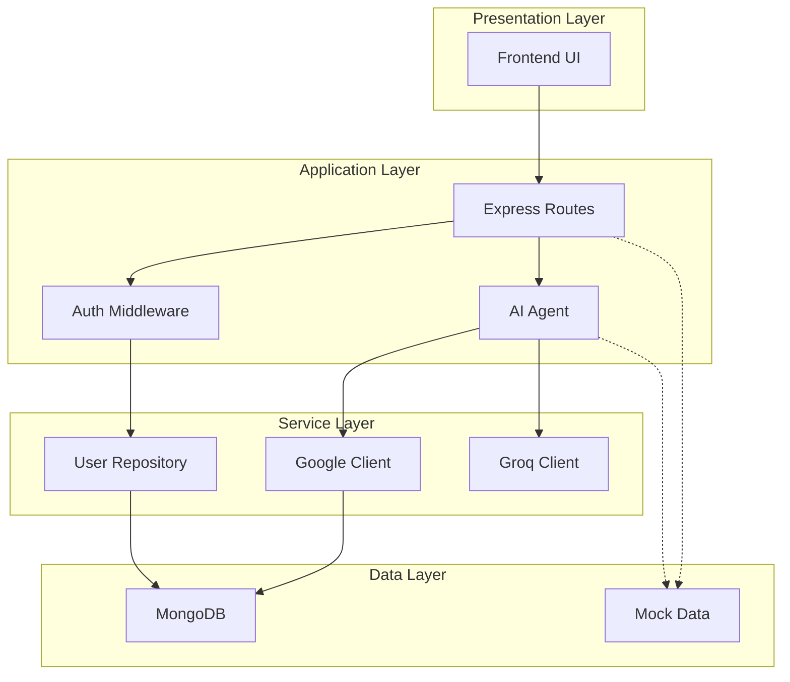

# AI Agent - Architecture Diagram

## High-Level System Architecture

```mermaid
graph TB
    subgraph "🌐 Client (Browser)"
        UI[Frontend UI<br/>HTML/CSS/JS]
    end

    subgraph "☁️ Vercel Serverless"
        API[Express Server]
        
        subgraph "📡 API Endpoints"
            Auth[/auth/*]
            Chat[/api/chat]
            Files[/api/files]
            Msgs[/api/messages]
            Tasks[/api/tasks]
        end
    end

    subgraph "🔐 Authentication"
        OAuth[Google OAuth 2.0]
        Session[Session Store]
    end

    subgraph "🤖 AI Services"
        Groq[Groq API<br/>Llama 3.3 70B]
    end

    subgraph "📧 Google APIs"
        Gmail[Gmail API]
        Drive[Drive API]
    end

    subgraph "💾 Data Storage"
        MongoDB[(MongoDB Atlas)]
        Mock[Mock Data<br/>Demo Mode]
    end

    UI -->|HTTP Requests| API
    API --> Auth
    API --> Chat
    API --> Files
    API --> Msgs
    API --> Tasks
    
    Auth --> OAuth
    Auth --> Session
    Session --> MongoDB
    
    Chat --> Groq
    Chat --> Gmail
    Chat --> Drive
    Chat -.->|Fallback| Mock
    
    Files --> Drive
    Files -.->|Fallback| Mock
    
    Msgs --> Gmail
    Msgs -.->|Fallback| Mock
    
    Tasks --> Gmail
    Tasks --> Groq

    style UI fill:#6366f1,stroke:#4f46e5,color:#fff
    style API fill:#8b5cf6,stroke:#7c3aed,color:#fff
    style Groq fill:#10b981,stroke:#059669,color:#fff
    style MongoDB fill:#3b82f6,stroke:#2563eb,color:#fff
    style OAuth fill:#ea4335,stroke:#c5221f,color:#fff
    style Mock fill:#f59e0b,stroke:#d97706,color:#fff
```

## Data Flow - User Request



## Component Layers



## Technology Stack

```
┌─────────────────────────────────────────────────────────┐
│                    Frontend Layer                        │
│  HTML5 │ CSS3 │ JavaScript │ Lucide Icons              │
└─────────────────────────────────────────────────────────┘
                          │
                          ▼
┌─────────────────────────────────────────────────────────┐
│                   Backend Layer                          │
│  Node.js │ Express.js │ TypeScript │ tsx               │
└─────────────────────────────────────────────────────────┘
                          │
        ┌─────────────────┼─────────────────┐
        ▼                 ▼                 ▼
┌──────────────┐  ┌──────────────┐  ┌──────────────┐
│  MongoDB     │  │  Groq API    │  │  Google APIs │
│  Atlas       │  │  Llama 3.3   │  │  OAuth/Gmail │
│              │  │  70B         │  │  /Drive      │
└──────────────┘  └──────────────┘  └──────────────┘
```

## File Structure

```
AI-Agent/
├── src/
│   ├── server.ts          # Express server setup
│   ├── config.ts          # Configuration
│   ├── api/               # API routes
│   │   ├── router.ts      # Route aggregator
│   │   ├── chat.ts        # AI chat endpoints
│   │   ├── files.ts       # Drive endpoints
│   │   ├── messages.ts    # Gmail endpoints
│   │   └── auth.ts        # Auth status
│   ├── auth/              # Authentication
│   │   ├── authRouter.ts  # OAuth flow
│   │   └── middleware.ts  # Auth middleware
│   ├── ai/                 # AI services
│   │   └── agent.ts        # Groq integration
│   ├── google/             # Google APIs
│   │   ├── client.ts       # OAuth client
│   │   ├── gmail.ts        # Gmail API
│   │   ├── drive.ts        # Drive API
│   │   ├── mockEmails.ts   # Demo emails
│   │   └── mockFiles.ts    # Demo files
│   └── db/                 # Database
│       ├── connection.ts    # MongoDB connection
│       ├── models/          # Data models
│       └── repositories/    # Data access
└── tabs/personal/           # Frontend
    ├── index.html
    ├── styles.css
    └── client.js
```

